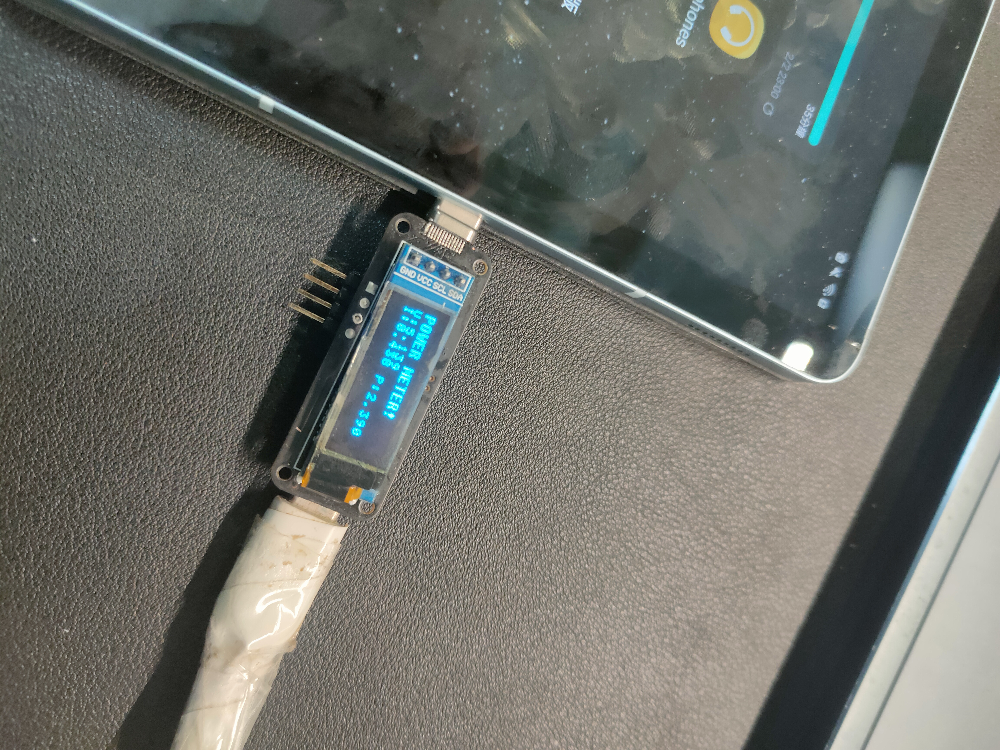
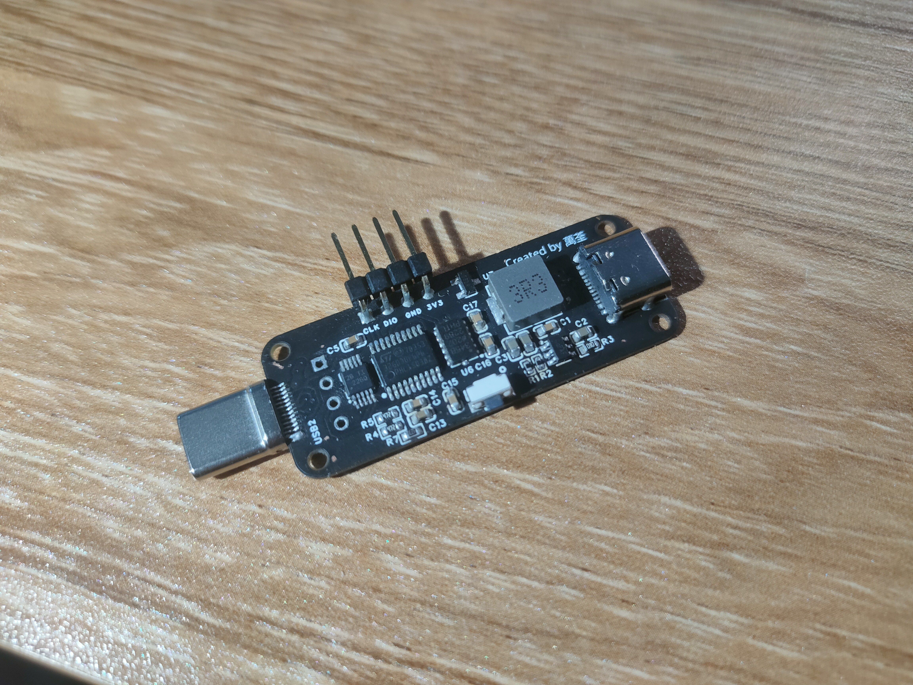
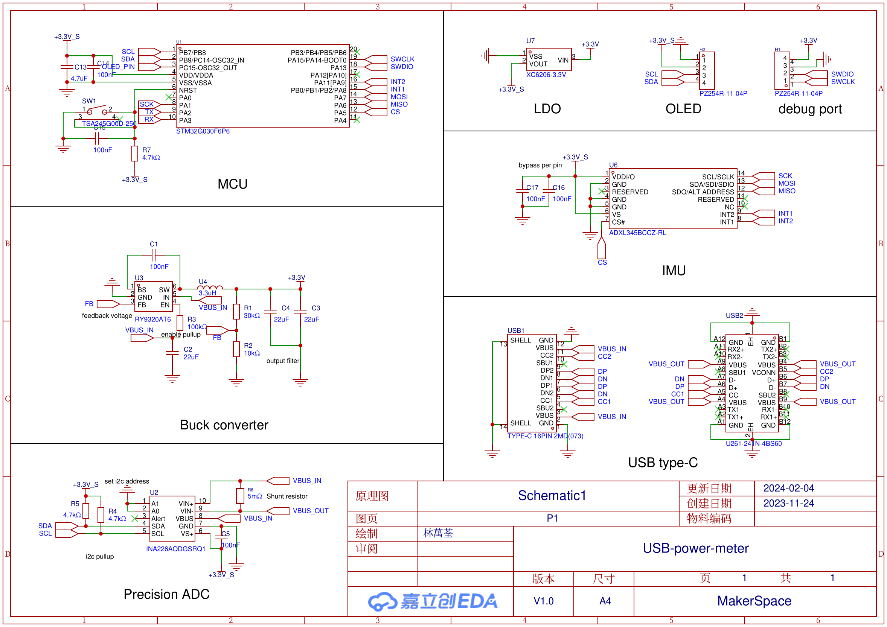
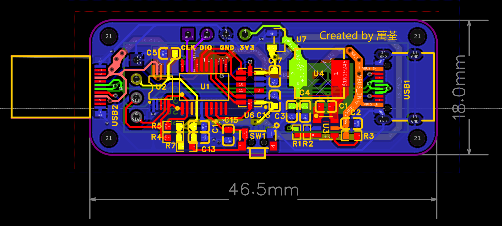
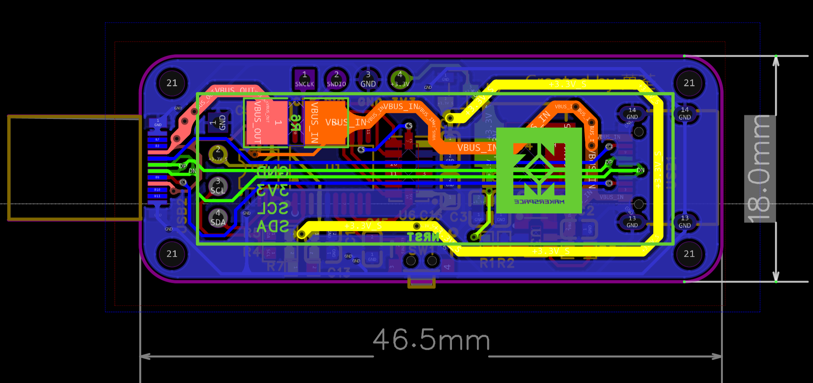

# USB Type-C Power Meter

This project is structured as STM32CubeIDE project. See _core_ folder for the main code.

## Description

This is a USB Type-C power meter that can measure voltage, current and power. It is based on the STM32G030F6P6 MCU, INA226 for precision ADC (16-bit resolution) and ADXL345 for haptic control.

<figure style="display: block; margin-left: auto; margin-right: auto; text-align: center;">
    
    <figcaption>Example usage of the USB Type-C Power Meter, measuring the charging status of a tablet</figcaption>
</figure>

<figure style="display: block; margin-left: auto; margin-right: auto; text-align: center;">
    
    <figcaption>Overview of the device</figcaption>
</figure>

## Schematic

<figure style="display: block; margin-left: auto; margin-right: auto; text-align: center;">
    
    <figcaption>schematic of the device</figcaption>
</figure>

## PCB Layout

<figure style="display: block; margin-left: auto; margin-right: auto; text-align: center;">
    
    <figcaption>Top layer of the PCB</figcaption>
</figure>

<figure style="display: block; margin-left: auto; margin-right: auto; text-align: center;">
    
    <figcaption>bottom layer of the PCB</figcaption>
</figure>
